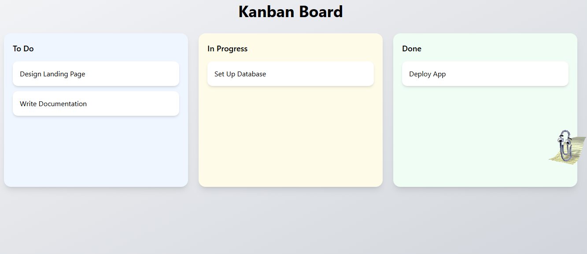

## Kanban Board (Trello-style)

A simplified Kanban board built with React that allows users to drag and drop tasks between columns using Optimistic UI updates and automatic rollback on failure.

 Live Demo

 https://kanban-board-one-gold.vercel.app/

 GitHub Repository

 https://github.com/Harsha1501/kanban-board

## Features
 Three-column layout:
To Do
In Progress
Done
Drag and drop tasks between columns
Instant UI updates (Optimistic UI)
Rollback if API fails
Simulated API delay (1.5 seconds)
20% random API failure simulation
Toast notifications for errors
Clean and modern UI using Tailwind CSS
Core Concept: Optimistic UI

This project demonstrates Optimistic UI updates, a technique used in modern frontend applications.

## How it works:

When a task is moved, the UI updates instantly.
A mock API request is sent in the background.
If the API succeeds → UI remains unchanged.
If the API fails → UI rolls back to previous state and shows an error notification.

## Tech Stack

React
Tailwind CSS
dnd-kit (Drag & Drop)
react-hot-toast (Notifications)

## Project Structure

src/
components/
Board.jsx
Column.jsx
TaskCard.jsx
data/
initialData.js
lib/
mockApi.js
App.jsx
index.css

## Mock API Details

Simulates a 1.5-second delay
Has a 20% chance of failure
setTimeout(() => {
  if (Math.random() < 0.2) reject(new Error("Server error"));
  else resolve();
}, 1500);
## Installation & Setup

# Clone repository
git clone https://github.com/Harsha1501/kanban-board.git

# Navigate into project
cd kanban-board

# Install dependencies
npm install

# Run the app
npm start

## Learning Outcomes

Implemented drag-and-drop functionality
Applied optimistic UI updates
Handled asynchronous API calls
Implemented rollback strategy on failure
Built a clean and responsive UI

## License

MIT license

